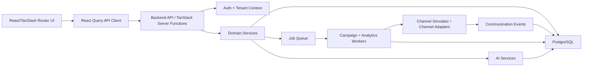

# Architecture

## Current Repository Baseline

Campaign Copilot is currently a TanStack Start, React 19, Vite, Tailwind, shadcn/Radix, Recharts dashboard. It has route-level screens for dashboard, AI Copilot, audiences, campaigns, analytics, customers, customer detail, campaign detail, and settings. Domain data is held in `src/lib/mock-data.ts`; there is no persistent database, authentication layer, job queue, or real channel integration yet.

The existing frontend already defines the product shape:

- Dashboard: high-level CRM, order, campaign, revenue, segment, and AI recommendation metrics.
- Customers: searchable customer table and customer profile.
- Audiences: natural-language and advanced-filter audience builder.
- Campaigns: campaign list, campaign detail, message preview, launch actions, and funnel stats.
- AI Copilot: end-to-end prompt-to-audience/channel/message workflow.
- Analytics: funnel, channel comparison, engagement trend, and revenue attribution.
- Settings: API key, channel configuration, and brand configuration.

## Target Architecture

Use the existing TanStack Start app as the web client and server-rendering host, then add a typed backend boundary, persistent relational database, asynchronous workers, AI orchestration, and simulated/real channel adapters.

## Architectural Principles

- Keep the frontend route structure intact while replacing mock arrays with API-backed React Query hooks.
- Model customers, orders, campaigns, communications, and communication events as first-class entities instead of chart-only aggregates.
- Use PostgreSQL as the source of truth for transactional CRM data and generated campaign artifacts.
- Use asynchronous jobs for campaign launches, message delivery simulation, channel webhooks, event ingestion, and metric rollups.
- Store AI outputs as auditable records with prompt, model, inputs, generated artifacts, and reviewer state.
- Design every table with tenant ownership from day one, even if the first version has one workspace.

## Core Components

### Customers

Purpose: Store shopper profiles, contactability, identity fields, preferences, lifecycle attributes, engagement score, and consent state.

Models: `Customer`, `CustomerIdentity`, `CustomerConsent`, `CustomerPreference`, `CustomerMetricSnapshot`.

APIs:

- `GET /api/customers`
- `POST /api/customers`
- `GET /api/customers/{customerId}`
- `PATCH /api/customers/{customerId}`
- `GET /api/customers/{customerId}/timeline`
- `GET /api/customers/{customerId}/orders`
- `GET /api/customers/{customerId}/communications`

Tradeoffs:

- A wide `customers` table makes the first dashboard easy but becomes brittle as profile fields grow.
- A normalized contact/consent model adds joins but is safer for channel compliance.
- Denormalized metrics such as `lifetime_spend` and `engagement_score` speed up lists but require rollup jobs.

Future scalability:

- Add customer identity resolution for multiple emails, phones, device IDs, and external platform IDs.
- Partition event-heavy timeline data separately from profile data.
- Support computed traits and feature-store style customer attributes for AI targeting.

### Orders

Purpose: Represent shopper purchase history used for segmentation, LTV, recency/frequency filters, conversion attribution, and customer detail pages.

Models: `Order`, `OrderItem`, `Product`, `OrderAttribution`.

APIs:

- `GET /api/orders`
- `POST /api/orders/import`
- `GET /api/orders/{orderId}`
- `GET /api/customers/{customerId}/orders`
- `GET /api/analytics/revenue-attribution`

Tradeoffs:

- Storing full order items enables product-aware campaigns but increases ingestion complexity.
- Keeping imported external IDs prevents duplicate imports but requires per-source uniqueness rules.
- Attribution can be calculated on demand initially, then materialized later for analytics speed.

Future scalability:

- Add idempotent ingestion from Shopify, WooCommerce, POS, CSV, or warehouse feeds.
- Create incremental rollups for RFM scores and product affinities.
- Move high-volume order analytics to read-optimized tables or a warehouse when needed.

### Audience Segments

Purpose: Save reusable customer groups defined by structured filters, natural-language prompts, AI-generated criteria, or static membership snapshots.

Models: `AudienceSegment`, `SegmentRule`, `SegmentMembership`, `SegmentEvaluationRun`, `SegmentInsight`.

APIs:

- `GET /api/audiences`
- `POST /api/audiences`
- `GET /api/audiences/{segmentId}`
- `PATCH /api/audiences/{segmentId}`
- `POST /api/audiences/preview`
- `POST /api/audiences/{segmentId}/evaluate`
- `GET /api/audiences/{segmentId}/members`
- `GET /api/audiences/{segmentId}/insights`

Tradeoffs:

- Dynamic segments stay fresh but can be slow for complex filters.
- Snapshot segments make campaign sends reproducible but can drift from current customer state.
- Storing rule JSON is flexible, but it needs validation and a stable query compiler.

Future scalability:

- Add a segment expression compiler with SQL generation and explain plans.
- Cache expensive segment evaluations.
- Support exclusion lists, suppression rules, holdout groups, and predictive propensity scores.

### Campaigns

Purpose: Plan, review, schedule, launch, pause, and analyze shopper engagement campaigns across channels.

Models: `Campaign`, `CampaignVersion`, `CampaignAudience`, `CampaignMessageVariant`, `CampaignSchedule`, `CampaignMetricSnapshot`.

APIs:

- `GET /api/campaigns`
- `POST /api/campaigns`
- `GET /api/campaigns/{campaignId}`
- `PATCH /api/campaigns/{campaignId}`
- `POST /api/campaigns/{campaignId}/launch`
- `POST /api/campaigns/{campaignId}/pause`
- `POST /api/campaigns/{campaignId}/duplicate`
- `GET /api/campaigns/{campaignId}/analytics`

Tradeoffs:

- A simple single-message campaign model is faster to ship but limits A/B testing and personalization.
- Versioning campaigns improves auditability but increases UI and API complexity.
- Launching directly from the request path is simple but risky; background jobs are more reliable.

Future scalability:

- Add journey campaigns with multi-step branching.
- Add approval workflows, experimentation, send-time optimization, and budget caps.
- Separate campaign read models from write models for high-volume analytics.

### Communications

Purpose: Represent every intended customer message created by a campaign, including channel, recipient, rendered content, delivery state, and provider/simulator identifiers.

Models: `Communication`, `CommunicationContent`, `CommunicationRecipient`, `CommunicationProviderAttempt`.

APIs:

- `GET /api/communications`
- `GET /api/communications/{communicationId}`
- `POST /api/campaigns/{campaignId}/communications/prepare`
- `POST /api/communications/{communicationId}/send`
- `POST /api/communications/bulk-send`

Tradeoffs:

- Creating one communication per recipient gives precise traceability but can create many rows.
- Rendering content at launch preserves exactly what was sent but reduces late personalization flexibility.
- Provider response payloads are useful for debugging but need retention controls.

Future scalability:

- Partition communications by tenant and month.
- Use bulk insert and streaming jobs for large campaigns.
- Add retry policies, rate limits, quiet hours, and channel-specific compliance checks.

### Communication Events

Purpose: Capture lifecycle events such as queued, sent, delivered, opened, clicked, converted, bounced, failed, unsubscribed, and simulated events.

Models: `CommunicationEvent`, `EventIngestionBatch`, `ConversionEvent`, `MetricRollup`.

APIs:

- `POST /api/events/communication`
- `POST /api/events/provider-webhook/{channel}`
- `GET /api/communications/{communicationId}/events`
- `GET /api/campaigns/{campaignId}/events`
- `GET /api/analytics/funnel`

Tradeoffs:

- Append-only events are auditable but require rollups for fast charts.
- Deduplicating events protects metrics but depends on stable provider event IDs.
- Conversion attribution needs a configurable lookback window, which can change business numbers.

Future scalability:

- Move event ingestion to queue-first processing.
- Partition events by time and tenant.
- Add materialized views for funnel, channel, cohort, and revenue attribution.

### AI Audience Builder

Purpose: Convert marketer natural language into valid, explainable segment criteria, preview matching customers, estimate size, and produce audience insights.

Models: `AiAudienceRequest`, `AiSegmentDraft`, `SegmentRule`, `AiRun`, `AiArtifact`, `SegmentInsight`.

APIs:

- `POST /api/ai/audience-builder/interpret`
- `POST /api/ai/audience-builder/preview`
- `POST /api/ai/audience-builder/save`
- `GET /api/ai/runs/{runId}`

Tradeoffs:

- AI-generated filters must be constrained to a validated schema to avoid unsafe or impossible queries.
- Returning reasoning improves marketer trust but can expose internal assumptions.
- Previewing real matching customers is useful but requires permission checks and PII care.

Future scalability:

- Add retrieval over brand rules, historical campaigns, product catalog, and segment performance.
- Add deterministic validation and test cases for generated segment rules.
- Support embeddings and predictive models for intent, churn, affinity, and next-best-channel.

### AI Campaign Generator

Purpose: Generate campaign concepts, audience recommendations, channel selection, message variants, personalization tokens, and launch-ready drafts from a prompt.

Models: `AiCampaignRequest`, `CampaignDraft`, `CampaignMessageVariant`, `AiRun`, `BrandProfile`, `ChannelRecommendation`.

APIs:

- `POST /api/ai/campaign-generator/generate`
- `POST /api/ai/campaign-generator/refine`
- `POST /api/ai/campaign-generator/create-campaign`
- `GET /api/ai/runs/{runId}`

Tradeoffs:

- Generating a full campaign in one call feels magical but is harder to validate.
- Multi-step generation is easier to inspect but may feel slower.
- AI-selected channels need historical performance data; until then, the system should explain confidence levels.

Future scalability:

- Add template libraries, tone controls, promotion constraints, and compliance guardrails.
- Add multi-variant generation and automatic winner selection.
- Store prompt and output lineage for auditability and model migration.

### Analytics Dashboard

Purpose: Provide operational and performance visibility across customers, orders, segments, campaigns, channels, funnel events, and revenue attribution.

Models: `MetricRollup`, `CampaignMetricSnapshot`, `SegmentMetricSnapshot`, `ChannelMetricSnapshot`, `RevenueAttribution`.

APIs:

- `GET /api/dashboard/summary`
- `GET /api/dashboard/recommendations`
- `GET /api/analytics/funnel`
- `GET /api/analytics/channel-performance`
- `GET /api/analytics/engagement-trend`
- `GET /api/analytics/revenue-attribution`
- `GET /api/analytics/customer-activity`

Tradeoffs:

- Querying live tables gives fresh data but can become slow.
- Precomputed rollups are fast but introduce data freshness delays.
- Revenue attribution can be simple last-touch first, but future teams may need multi-touch logic.

Future scalability:

- Add scheduled rollup jobs and materialized views.
- Add metric definitions with versioning so historical dashboards remain explainable.
- Support date range, channel, campaign, city, segment, and cohort filters.

### Channel Simulator Service

Purpose: Simulate message delivery, engagement, failure, and conversion events for demo, testing, and development before real providers are connected.

Models: `ChannelProvider`, `SimulationProfile`, `SimulationRun`, `CommunicationEvent`.

APIs:

- `POST /api/simulator/campaigns/{campaignId}/run`
- `POST /api/simulator/communications/{communicationId}/event`
- `GET /api/simulator/runs/{runId}`
- `PATCH /api/settings/channels/{channel}/simulation-profile`

Tradeoffs:

- Simulation enables full funnel development without provider accounts, but it must be visually labeled to avoid confusing fake and real performance.
- Deterministic seeded simulations are good for demos; probabilistic simulations are better for load and analytics testing.
- Channel-specific behavior improves realism but increases maintenance.

Future scalability:

- Add provider adapters behind a common interface: simulator, email, WhatsApp, SMS, push.
- Add rate-limit simulation, bounce profiles, quiet hours, unsubscribe handling, and webhook replay.
- Use the same event pipeline for simulated and real providers.

## Recommended Service Boundaries

- CRM Service: customers, contacts, consent, preferences, customer metrics.
- Commerce Service: orders, products, order attribution, order imports.
- Audience Service: segment definitions, membership evaluation, insights.
- Campaign Service: campaigns, versions, schedules, launches, message variants.
- Communication Service: communication preparation, rendering, send state, retries.
- Event Service: event ingestion, deduplication, conversion attribution.
- AI Service: audience interpretation, campaign generation, model call audit.
- Analytics Service: rollups, dashboard endpoints, recommendation summaries.
- Channel Service: simulator and provider adapters.

In the first implementation, these can live as modules inside one backend. The boundaries should still be visible in folders, database ownership, and API contracts so they can split later if necessary.
