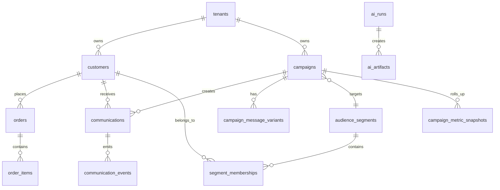

# Data Model Design

## Modeling Goals

- Replace frontend mock data with durable CRM, commerce, campaign, communication, AI, and analytics records.
- Keep campaign sends reproducible by storing the segment snapshot and rendered communication content used at launch time.
- Make every high-volume event append-only and roll metrics up separately.
- Store AI actions as auditable runs rather than transient UI responses.
- Support multi-tenant workspaces from the first schema version.

## Shared Conventions

All core models should include:

- `id`: UUID primary key.
- `tenant_id`: UUID owner/workspace identifier.
- `created_at`: timestamp with time zone.
- `updated_at`: timestamp with time zone where records are mutable.
- `deleted_at`: nullable timestamp for soft deletion where user-facing deletion is needed.
- `metadata`: JSONB for integration-specific fields that do not deserve first-class columns yet.

Enums:

- `channel`: `email`, `whatsapp`, `sms`, `push`.
- `campaign_status`: `draft`, `scheduled`, `active`, `paused`, `completed`, `archived`.
- `communication_status`: `pending`, `queued`, `sent`, `delivered`, `opened`, `clicked`, `converted`, `failed`, `bounced`, `unsubscribed`, `cancelled`.
- `event_type`: `prepared`, `queued`, `sent`, `delivered`, `opened`, `clicked`, `converted`, `failed`, `bounced`, `unsubscribed`, `simulated`.
- `ai_run_type`: `audience_builder`, `campaign_generator`, `analytics_insight`, `channel_recommendation`.

## Entity Overview



## Component Designs

### Customers

Purpose: Central customer profile and engagement state.

Models:

- `Customer`: name, email, phone, city, region, country, preferred channel, lifecycle status, engagement score, lifetime spend, last purchase date.
- `CustomerIdentity`: external system identifiers such as Shopify customer ID, CRM ID, phone hash, device ID.
- `CustomerConsent`: channel opt-in status, source, timestamp, legal basis.
- `CustomerPreference`: preferred categories, brands, language, quiet hours.
- `CustomerMetricSnapshot`: date-scoped engagement, spend, recency, frequency, and channel metrics.

Relationships:

- One customer has many orders.
- One customer receives many communications.
- One customer belongs to many audience segments through membership records.

Tradeoffs:

- Put common fields on `customers` for fast tables and search.
- Move channel consent into a separate table to avoid overwriting compliance history.
- Keep score fields denormalized because they appear throughout the UI.

Future scalability:

- Add identity resolution for duplicate profiles.
- Add customer traits as typed JSONB or a dedicated feature table.
- Add PII encryption for phone, email, address, and sensitive metadata.

### Orders

Purpose: Purchase history for customer profiles, segmentation, analytics, and conversion attribution.

Models:

- `Order`: external ID, customer ID, order number, status, currency, subtotal, discount, tax, shipping, total, placed_at.
- `OrderItem`: product ID, SKU, product name, category, quantity, unit price, total.
- `Product`: SKU, title, category, tags, price, status.
- `OrderAttribution`: campaign, communication, attribution model, attribution window, attributed revenue.

Tradeoffs:

- Product data can be minimal at first and expanded when product-aware AI campaigns arrive.
- Order item snapshots should keep historical names/prices even if product records change.
- Attribution can be stored after conversion jobs to keep analytics fast.

Future scalability:

- Support order ingestion batch records with idempotency.
- Add returns, refunds, subscriptions, and fulfillment status.
- Add RFM snapshots and product affinity features.

### Audience Segments

Purpose: Define and reuse shopper groups.

Models:

- `AudienceSegment`: name, description, source type, rule JSON, status, estimated size, last evaluated at.
- `SegmentRule`: optional normalized rule rows if rule editing needs granular history.
- `SegmentMembership`: customer membership snapshot with evaluation run ID.
- `SegmentEvaluationRun`: execution status, row counts, duration, errors, generated SQL hash.
- `SegmentInsight`: AI and analytics summary for a segment.

Rule JSON example:

```json
{
  "operator": "and",
  "conditions": [
    { "field": "lifetime_spend", "op": "gt", "value": 10000 },
    { "field": "last_purchase_at", "op": "before_relative_days", "value": 60 },
    { "field": "preferred_channel", "op": "eq", "value": "whatsapp" }
  ]
}
```

Tradeoffs:

- JSON rules allow fast AI output validation and UI rendering.
- Normalized rule rows are easier for reporting but slower to evolve.
- Store both only if the UI needs detailed rule editing history.

Future scalability:

- Add compiled query cache and rule versioning.
- Add membership diffs to track growth/churn of segments.
- Add predictive audiences from model scores.

### Campaigns

Purpose: Store marketing campaign lifecycle, target audience, channels, content, schedules, and launch state.

Models:

- `Campaign`: name, objective, status, primary channel, target segment, schedule fields, created by.
- `CampaignVersion`: immutable version of campaign settings before launch.
- `CampaignAudience`: segment snapshot, exclusions, holdout percentage, final recipient count.
- `CampaignMessageVariant`: subject, body, CTA, token map, channel-specific payload.
- `CampaignSchedule`: start time, timezone, send window, recurrence if future journeys are added.
- `CampaignMetricSnapshot`: daily or hourly rollups.

Tradeoffs:

- Start with one primary channel per campaign because the UI currently assumes one channel badge.
- Allow multiple message variants in the data model so A/B testing can be added without a migration.
- Use status transitions in the backend rather than trusting client-side buttons.

Future scalability:

- Add multi-channel journeys.
- Add approval workflows and content compliance.
- Add campaign budget and frequency caps.

### Communications

Purpose: One row per recipient message generated from a campaign.

Models:

- `Communication`: campaign ID, customer ID, channel, status, scheduled_at, sent_at, delivered_at.
- `CommunicationContent`: rendered subject/body/payload, personalization tokens, content hash.
- `CommunicationProviderAttempt`: provider/simulator request, response, attempt number, error details.

Tradeoffs:

- Per-recipient rows support traceability and customer timeline screens.
- For very large sends, communication creation must happen in batches.
- Rendered content should be immutable after send.

Future scalability:

- Table partitioning by month.
- Bulk inserts and worker-side streaming.
- Channel-specific payload validation before queuing.

### Communication Events

Purpose: Append-only lifecycle and engagement events.

Models:

- `CommunicationEvent`: communication, campaign, customer, event type, occurred_at, provider event ID, payload.
- `EventIngestionBatch`: webhook or simulator import tracking.
- `ConversionEvent`: purchase or goal event linked to a communication.
- `MetricRollup`: aggregated counts for dashboard APIs.

Tradeoffs:

- Event rows can grow quickly, so indexes must be intentional.
- Use append-only events for audit; update current status on `communications` for fast UI reads.
- Keep provider payloads but define retention for sensitive data.

Future scalability:

- Deduplicate by tenant, provider, provider event ID.
- Partition by occurred month.
- Use event streams if webhook volume grows.

### AI Audience Builder

Purpose: Natural-language segment creation and explanation.

Models:

- `AiRun`: prompt, run type, model, status, input context references, output summary, token/cost metrics.
- `AiArtifact`: structured output such as segment rules, explanation, suggested name, warnings.
- `AiSegmentDraft`: draft rule set before saving as a real segment.

Tradeoffs:

- AI artifacts should be stored separately from production segments until the user saves them.
- Validation must reject unknown fields/operators.
- Human-readable reasoning is useful but should not be the source of truth.

Future scalability:

- Add model evaluation records for generated SQL safety and quality.
- Add prompt templates by tenant and brand.
- Add feedback signals from accepted/rejected AI suggestions.

### AI Campaign Generator

Purpose: Generate launch-ready campaign drafts.

Models:

- `AiRun`: campaign generator run.
- `CampaignDraft`: generated objective, audience, channel recommendation, message, assumptions.
- `AiArtifact`: message variants, channel recommendation, predicted metrics.
- `BrandProfile`: brand name, sender name, tone, disclaimer, forbidden claims.

Tradeoffs:

- Drafts are not campaigns until user review, which avoids accidental sends.
- Store predicted metrics separately from actual metrics.
- Brand and compliance constraints should be injected into generation and validated after generation.

Future scalability:

- Add variant ranking and offline evaluation.
- Add content safety checks and regulated-claim policies.
- Add retrieval over historical winning campaigns.

### Analytics Dashboard

Purpose: Present CRM and engagement performance efficiently.

Models:

- `MetricRollup`: generic dimensional aggregate table.
- `CampaignMetricSnapshot`: campaign-specific counters and rates.
- `ChannelMetricSnapshot`: channel-level counters and rates.
- `SegmentMetricSnapshot`: audience size, growth, conversion, revenue.

Tradeoffs:

- A generic rollup table is flexible but less self-documenting.
- Dedicated snapshot tables are clearer but multiply as dashboards grow.
- Initial version can query live plus cached rollups for heavier charts.

Future scalability:

- Use materialized views for common date/channel filters.
- Add metric lineage and rollup job health.
- Add warehouse export once volume exceeds application database comfort.

### Channel Simulator Service

Purpose: Generate realistic communication outcomes without real providers.

Models:

- `ChannelProvider`: configured provider per channel, including `simulator`.
- `SimulationProfile`: channel probabilities for delivered/opened/clicked/converted/failed.
- `SimulationRun`: campaign, seed, status, generated event counts.

Tradeoffs:

- Store simulation profiles in the database so demos are repeatable.
- Mark simulated events explicitly.
- Use the same communication event table as real providers to exercise analytics.

Future scalability:

- Add provider-specific adapters behind the same interface.
- Replay simulator webhooks for local development.
- Support load testing with seeded high-volume campaigns.
