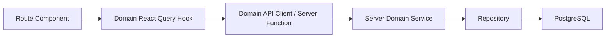

# Integration Plan With Existing Frontend

## Current Frontend Integration Points

The current app imports all business data from `src/lib/mock-data.ts`. Route files render static arrays and local state:

- `src/routes/index.tsx`: dashboard stats, campaign trend, channel performance, customer activity, AI recommendations, recent campaigns, top segments.
- `src/routes/customers.tsx`: customer table.
- `src/routes/customers.$id.tsx`: customer lookup, purchase history, campaign history.
- `src/routes/audiences.tsx`: audience builder UI with local random audience size.
- `src/routes/campaigns.tsx`: campaign table.
- `src/routes/campaigns.$id.tsx`: campaign detail and computed funnel.
- `src/routes/copilot.tsx`: local mock AI result and delayed response.
- `src/routes/analytics.tsx`: funnel, engagement, revenue, and AI insight mock arrays.
- `src/routes/settings.tsx`: local-only configuration UI.

The app already includes React Query and TanStack Router context, so the migration path should use query hooks and server functions/API clients rather than direct imports.

## Integration Strategy

1. Preserve routes and visual components.
2. Introduce domain query hooks that return the same shapes the UI currently expects.
3. Point hooks at mock-backed API functions first.
4. Swap API functions to database-backed services as backend phases land.
5. Delete `mock-data.ts` only after every route is API-backed.

## Proposed Frontend Data Flow



## Route-by-Route Migration

### Dashboard Route

Purpose: Show CRM, campaign, customer, revenue, segment, and AI recommendation overview.

Models: `Customer`, `Order`, `Campaign`, `AudienceSegment`, `MetricRollup`, `AiArtifact`.

APIs:

- `GET /api/dashboard/summary`
- `GET /api/dashboard/recommendations`
- `GET /api/analytics/campaign-trend`
- `GET /api/analytics/channel-performance`
- `GET /api/analytics/customer-activity`
- `GET /api/campaigns?limit=5&sort=-createdAt`
- `GET /api/audiences?sort=-performance&limit=4`

Frontend changes:

- Replace `stats`, `campaignTrend`, `channelPerformance`, `customerActivity`, `aiRecommendations`, `recentCampaigns`, and `topSegments` imports with dashboard hooks.
- Add loading skeletons for stat cards and charts.
- Add empty states for no campaigns or no segments.

Tradeoffs:

- One composite dashboard endpoint reduces network calls.
- Separate endpoints are more reusable for analytics pages.

Recommended v1: use one `useDashboardSummary` plus smaller chart hooks where charts are reused.

Future scalability:

- Add date range and channel filters.
- Add stale time and background refetch for near-real-time metrics.

### Customers Route

Purpose: Search and browse customers.

Models: `Customer`, `CustomerConsent`, `CustomerMetricSnapshot`.

APIs:

- `GET /api/customers`
- `POST /api/customers`
- `GET /api/customers/{customerId}`

Frontend changes:

- Connect search input to `q` with debounce.
- Add pagination.
- Use `ChannelBadge` with normalized lowercase API channel mapped to display labels.
- Implement Add customer dialog later.

Tradeoffs:

- Client-side search is simple but does not scale.
- Server-side search supports large datasets and consistent results.

Future scalability:

- Add filters for city, spend, last purchase, and preferred channel.
- Add saved views.

### Customer Detail Route

Purpose: Customer profile, purchase history, and communication timeline.

Models: `Customer`, `Order`, `Communication`, `CommunicationEvent`.

APIs:

- `GET /api/customers/{customerId}`
- `GET /api/customers/{customerId}/orders`
- `GET /api/customers/{customerId}/communications`
- `GET /api/customers/{customerId}/timeline`

Frontend changes:

- Replace route loader mock lookup with API-backed loader or query hook.
- Replace local `purchases` and `campaignsSent` arrays with timeline data.
- Show not-found state from API 404.

Tradeoffs:

- Route loaders can prefetch detail data for SSR.
- React Query hooks make partial loading and refetch easier.

Future scalability:

- Add communication event drill-down.
- Add customer-level AI suggestions.

### Audiences Route

Purpose: Build audiences with natural language or advanced filters.

Models: `AudienceSegment`, `SegmentRule`, `SegmentMembership`, `AiRun`, `AiArtifact`.

APIs:

- `POST /api/ai/audience-builder/interpret`
- `POST /api/audiences/preview`
- `POST /api/audiences`
- `POST /api/audiences/{segmentId}/evaluate`
- `GET /api/audiences/{segmentId}/insights`

Frontend changes:

- Natural-language tab calls AI interpret and preview instead of random size.
- Advanced filters produce the same rule JSON as AI output.
- Audience Preview table reads preview customers from API.
- Save Audience posts validated rule JSON.

Tradeoffs:

- Shared rule schema keeps AI and manual filters consistent.
- Preview calls can be expensive; debounce or explicit button is appropriate.

Future scalability:

- Add visible rule editor after AI interpretation.
- Add async evaluation status and membership diff.

### Campaigns Route

Purpose: Browse and manage campaign lifecycle.

Models: `Campaign`, `CampaignMessageVariant`, `CampaignMetricSnapshot`.

APIs:

- `GET /api/campaigns`
- `POST /api/campaigns`
- `POST /api/campaigns/{campaignId}/launch`
- `POST /api/campaigns/{campaignId}/pause`

Frontend changes:

- Replace campaign table mock imports with `useCampaigns`.
- Connect status tabs to query params.
- Connect search input to `q`.
- Wire Launch action to mutation with confirmation.

Tradeoffs:

- Query params make campaign list state shareable.
- Optimistic status changes can feel fast but must handle launch validation failures.

Future scalability:

- Add create/edit campaign drawer.
- Add bulk actions and scheduled-send calendar.

### Campaign Detail Route

Purpose: Inspect campaign content, audience, delivery statistics, and funnel.

Models: `Campaign`, `AudienceSegment`, `Communication`, `CommunicationEvent`, `CampaignMetricSnapshot`.

APIs:

- `GET /api/campaigns/{campaignId}`
- `GET /api/campaigns/{campaignId}/analytics`
- `GET /api/campaigns/{campaignId}/events`
- `POST /api/campaigns/{campaignId}/launch`
- `POST /api/campaigns/{campaignId}/pause`

Frontend changes:

- Replace route loader mock lookup with campaign detail API.
- Replace locally computed funnel with analytics endpoint.
- Render real message variant preview.
- Use audience summary from campaign snapshot.

Tradeoffs:

- Campaign detail should not fetch all communications by default.
- Funnel data should be rollup-backed after events exist.

Future scalability:

- Add event timeline tab.
- Add variant comparison and audience breakdown.

### AI Copilot Route

Purpose: Generate campaign drafts from plain English.

Models: `AiRun`, `CampaignDraft`, `AudienceSegment`, `CampaignMessageVariant`, `ChannelRecommendation`.

APIs:

- `POST /api/ai/campaign-generator/generate`
- `POST /api/ai/campaign-generator/refine`
- `POST /api/ai/campaign-generator/create-campaign`
- `POST /api/campaigns/{campaignId}/launch`

Frontend changes:

- Replace `mockResult` and `setTimeout` with a mutation.
- Show AI run status, validation warnings, and generated draft.
- Launch button should first create a campaign draft, then launch only after explicit confirmation.
- Add edit/refine flow for generated message.

Tradeoffs:

- Streaming AI responses improve perceived speed but add complexity.
- Non-streaming structured output is easier for the first reliable version.

Future scalability:

- Add chat history and draft persistence.
- Add campaign generation from saved AI recommendations.

### Analytics Route

Purpose: Show full-funnel, channel, engagement, revenue, and AI insight analytics.

Models: `MetricRollup`, `CampaignMetricSnapshot`, `ChannelMetricSnapshot`, `RevenueAttribution`, `AiArtifact`.

APIs:

- `GET /api/analytics/funnel`
- `GET /api/analytics/channel-performance`
- `GET /api/analytics/engagement-trend`
- `GET /api/analytics/revenue-attribution`
- `GET /api/analytics/insights`

Frontend changes:

- Replace mock analytics arrays with analytics hooks.
- Add date range control.
- Add loading and empty chart states.
- Add rollup freshness indicator.

Tradeoffs:

- Chart-ready endpoints keep current Recharts components simple.
- Generic metric explorer endpoints can be added later.

Future scalability:

- Add filters by campaign, segment, city, and channel.
- Add drill-down links from chart points to campaign/customer lists.

### Settings Route

Purpose: Configure brand, AI, and channels.

Models: `BrandProfile`, `ChannelProvider`, `SimulationProfile`, `AiSettings`.

APIs:

- `GET /api/settings/brand`
- `PATCH /api/settings/brand`
- `GET /api/settings/channels`
- `PATCH /api/settings/channels/{channel}`
- `POST /api/settings/channels/{channel}/test`
- `PATCH /api/settings/ai`

Frontend changes:

- Load persisted brand profile.
- Save channel enabled state and provider configuration.
- Never display saved API key values; show masked status instead.
- Add Test Channel action.

Tradeoffs:

- Settings mutations need clear success/error handling.
- Secrets should be write-only from the client perspective.

Future scalability:

- Add RBAC and audit log for settings changes.
- Add separate simulator and production provider config.

## Cross-Cutting Frontend Work

### Query Keys

Use stable query key factories:

```text
customers.list(params)
customers.detail(customerId)
customers.timeline(customerId)
campaigns.list(params)
campaigns.detail(campaignId)
campaigns.analytics(campaignId, params)
audiences.preview(rule)
analytics.funnel(params)
settings.channels()
```

### Loading and Empty States

Each route should support:

- initial loading,
- background refetch,
- empty data,
- API validation errors,
- permission errors,
- not found.

### Type Mapping

The current UI uses display channels like `Email` and `WhatsApp`. Backend should use lowercase enum values. Add a single mapping utility:

```text
email -> Email
whatsapp -> WhatsApp
sms -> SMS
push -> Push
```

### Mock Compatibility

Before the database lands, API wrappers can return the current mock data. This gives a smooth migration:

1. Route imports hook.
2. Hook calls mock-backed API.
3. Backend implementation swaps API internals.
4. Route stays stable.

## Integration Sequence

1. Add shared types/schemas for all current mock shapes.
2. Add domain API wrappers and React Query hooks.
3. Migrate Dashboard and Analytics first because they are read-only.
4. Migrate Customers and Customer Detail.
5. Migrate Campaigns and Campaign Detail.
6. Migrate Audiences with real preview contract.
7. Migrate Copilot to real AI mutation.
8. Migrate Settings.
9. Remove direct imports from `src/lib/mock-data.ts`.
10. Delete `mock-data.ts` after seed data exists.

## Risks

- Metric definitions may drift if frontend and backend compute rates differently.
- AI outputs can break UI assumptions unless all generated objects are schema-validated.
- Campaign launch can become slow if audience evaluation, communication creation, and sending are synchronous.
- Real channel providers introduce compliance and webhook security requirements.

## Recommended First Slice

Build a thin API layer that returns the existing mock data through React Query hooks. This unlocks frontend integration without waiting for the database. Then replace one domain at a time with database-backed services, starting with customers and campaigns.
